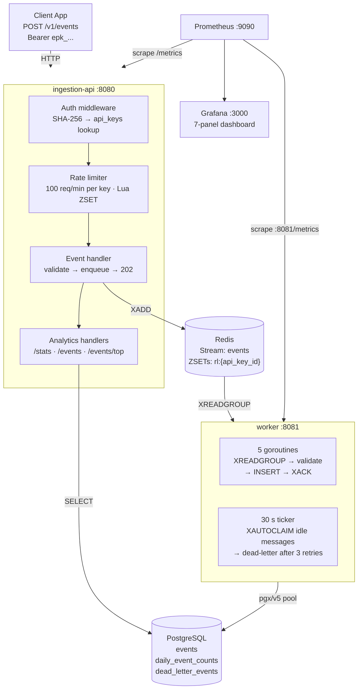

# EventPulse

A production-style Go event ingestion and analytics backend — inspired by Segment and PostHog.

[](https://github.com/matangi/eventpulse/actions/workflows/ci.yml)


Client applications POST events to the ingestion API. Events are validated, rate-limited per API key, and enqueued to Redis Streams. A separate worker service consumes the queue, persists events to PostgreSQL, and updates aggregate counters. An analytics API surfaces the stored data.

**1,976 req/s at 1,000 VUs · zero 5xx errors · p95 = 10 ms (uncongested)**

---

## Try It Live

> Live demo coming soon. Run locally with Docker Compose in the meantime — see [Quick Start](#quick-start).

```bash
# Ingest an event
curl -X POST https://<demo-url>/v1/events \
  -H "Authorization: Bearer <demo-key>" \
  -H "Content-Type: application/json" \
  -d '{"event":"page_viewed","user_id":"user_42","properties":{"page":"/pricing"}}'
# → 202 {"status":"queued"}

# Query project stats
curl https://<demo-url>/v1/projects/<project-id>/stats \
  -H "Authorization: Bearer <demo-key>"
```

---

## Architecture



---

## Performance

Tested on a single Windows 11 host (all services co-located — no network round-trip). See [docs/performance.md](docs/performance.md) for full methodology and bottleneck analysis.

| Scenario | Total RPS | Ingested (202) | p95 latency | 5xx rate |
|---|---|---|---|---|
| Smoke test (1 VU) | ~254 | ~10 req/s | **10 ms** | 0% |
| 50-key · 1,000 VU | ~1,297 | ~127 req/s | 657 ms | 0.008% |
| 100-key · 1,000 VU | ~1,976 | ~282 req/s | 547 ms | **0%** |

The p95 rise at 1,000 VUs is Redis single-thread serialization under extreme concurrency on a single host — not an application bottleneck. Zero 5xx errors across all load levels.

---

## Quick Start

**Prerequisites:** Docker, Go 1.22+, [golang-migrate](https://github.com/golang-migrate/migrate)

```bash
# 1. Start infrastructure (Postgres + Redis)
make infra-up

# 2. Copy env and apply migrations
cp .env.example .env
make migrate

# 3. Generate an API key (prints the raw epk_... value)
make seed
```

Then in two terminals:

```bash
make run-api     # ingestion API on :8080
make run-worker  # worker consumer
```

Verify:

```bash
curl http://localhost:8080/readyz
# → {"status":"ok"}
```

To see live metrics in Grafana:

```bash
make infra-obs   # Prometheus :9090 + Grafana :3000
```

---

## API Endpoints

All authenticated endpoints require `Authorization: Bearer epk_...`. See [docs/api.md](docs/api.md) for full request/response examples and error codes.

| Method | Path | Auth | Description |
|---|---|---|---|
| `GET` | `/healthz` | — | Liveness check |
| `GET` | `/readyz` | — | Readiness: DB + Redis ping |
| `GET` | `/metrics` | — | Prometheus metrics |
| `POST` | `/v1/events` | ✓ | Ingest a single event → 202 |
| `POST` | `/v1/events/batch` | ✓ | Ingest up to 100 events → 202 |
| `GET` | `/v1/projects/{id}/stats` | ✓ | Total events, today's count, top 5 names |
| `GET` | `/v1/projects/{id}/events` | ✓ | Paginated event list (filter by name, user, date) |
| `GET` | `/v1/projects/{id}/events/top` | ✓ | Top N event names by count |
| `GET` | `/v1/projects/{id}/users/{uid}/events` | ✓ | All events for a user |

---

## Key Engineering Decisions

- **Atomic Lua rate limiter** — a single Redis script (ZREMRANGEBYSCORE + ZCARD + ZADD) makes the check-and-increment operation atomic, preventing races between concurrent requests. Returns `Retry-After` on 429.
- **Redis Streams for async ingestion** — XADD/XREADGROUP gives persistent, at-least-once delivery with consumer groups. The ingestion API returns 202 immediately; writes never block the HTTP path.
- **Dead-letter after 3 delivery failures** — un-ACK'd messages are reclaimed via XAUTOCLAIM every 30 seconds. After 3 deliveries the message moves to `dead_letter_events` in Postgres for operator inspection and replay.
- **testcontainers for integration tests** — every integration test spins up real Postgres and Redis instances in Docker; no in-memory fakes, no divergence from production behaviour.

---

## Local Development

```bash
make test                    # unit + integration tests
make test-cover              # generate coverage.html
make lint                    # golangci-lint
make build                   # compile both binaries to bin/
make seed SEED_COUNT=50      # generate 50 API keys for load testing
make loadtest                # k6 load test (requires EVENTPULSE_API_KEYS)
```

---

## Documentation

- [Architecture](docs/architecture.md) — system diagram, component reference, data flow sequences
- [API Reference](docs/api.md) — all 9 endpoints with curl examples and error codes
- [Performance](docs/performance.md) — load test methodology and results
- [Trade-offs](docs/tradeoffs.md) — async vs sync, Redis rate limiting, JSONB, crash recovery, scaling paths
