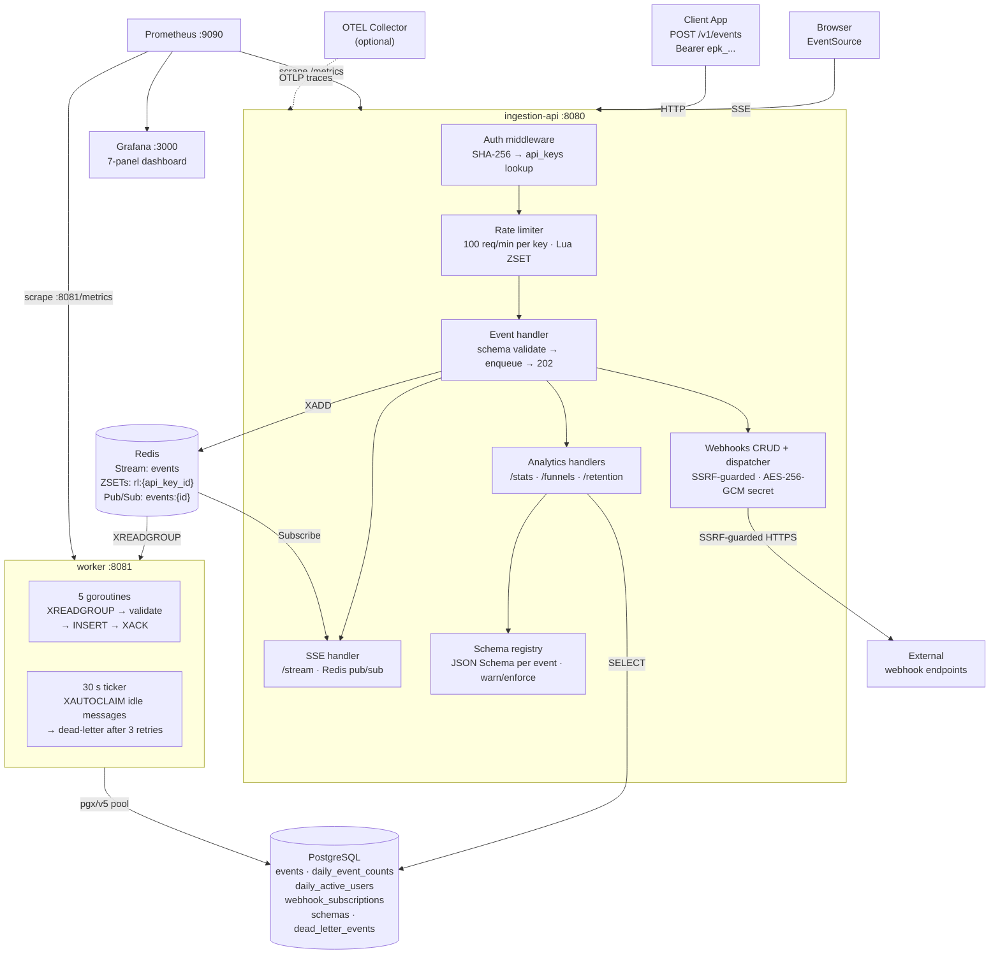
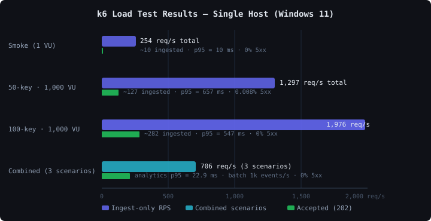

# EventPulse

A production-style Go event ingestion and analytics backend — inspired by Segment and PostHog.

[](https://github.com/matanate/eventpulse/actions/workflows/ci.yml)

[](https://eventpulse.atedgimatan.com)
[](https://eventpulse.atedgimatan.com/docs)

Client applications POST events to the ingestion API. Events are validated, rate-limited per API key, and enqueued to Redis Streams. A separate worker service consumes the queue, persists events to PostgreSQL, and updates aggregate counters. An analytics API surfaces the stored data.

---

## What this demonstrates

Each design decision answers a specific engineering question:

**How do you prevent duplicate events from client retries?**
`POST /v1/events` accepts an `Idempotency-Key: <uuid>` header. The key maps to a partial unique index on the `events` table — Postgres `ON CONFLICT DO NOTHING` means a retried request returns 202 but stores nothing. Both the HTTP layer and the storage layer are idempotent.

**How do you guarantee events aren't lost if the worker crashes?**
Redis Streams consumer groups keep messages un-ACK'd until a worker calls `XACK`. A 30-second ticker runs `XAUTOCLAIM` to redeliver any messages idle past the visibility timeout. After 3 delivery failures the message moves to `dead_letter_events` in Postgres for operator inspection and replay.

**How do you make rate-limiting race-free under concurrent requests?**
A single Redis Lua script — `ZREMRANGEBYSCORE + ZCARD + ZADD` — checks and increments the sliding-window counter atomically. No read-modify-write race between goroutines. Returns `Retry-After` on 429.

**How do you test a distributed system without slow or flaky mocks?**
Every integration test spins up real Postgres and Redis instances via `testcontainers-go`. The test hits the actual driver, the actual schema, the actual constraints — the same code path as production. Zero mock drift.

**How do you keep the HTTP path fast when storage writes are variable-latency?**
`POST /v1/events` calls `XADD` on a Redis Stream and returns 202 immediately. The worker `XREADGROUP`s at its own pace as a separate process. Ingestion latency is bounded by Redis (~1 ms), not Postgres.

**How do you protect outgoing webhook delivery from SSRF?**
Webhook URLs are validated before storage and again at delivery via a custom `safeDial` that resolves the hostname, checks every returned IP against RFC1918/loopback/CGNAT/ULA blocklists, and connects directly to the resolved IP — eliminating the DNS-rebinding TOCTOU window. Redirects are disabled. The signing secret is stored as AES-256-GCM ciphertext; deliveries carry `X-EventPulse-Signature: sha256=<hmac>`.

**How do you enforce event property contracts without breaking existing clients?**
The schema registry stores a JSON Schema for any named event. In `enforce` mode, events whose `properties` violate the schema are rejected with 422 and field-level errors. In `warn` mode the event is accepted and a `schema_violation` counter increments. Teams promote from warn → enforce once all clients send conforming payloads — gradual rollout, no big-bang cutover.

**How do you push events to a browser without polling?**
`GET /v1/projects/{id}/stream` opens a Server-Sent Events connection backed by Redis pub/sub. After enqueue the ingestion handler publishes to `events:{projectID}` on Redis; the SSE handler subscribes and forwards each message as a `data:` frame in < 1 ms. The connection clears the server-level write deadline and sets `X-Accel-Buffering: no` so proxy layers don't buffer frames.

---

## Try It Live

**[→ Open live dashboard](https://eventpulse.atedgimatan.com)** — send events and watch them appear in real time.

**[→ API Reference](https://eventpulse.atedgimatan.com/docs)** — interactive Scalar UI pointing at the live Railway API.

The API is live on Railway. Use the demo key below — rate-limited to 100 req/min.

```bash
export DEMO_URL=https://ingestion-api-production-137c.up.railway.app
export DEMO_KEY=epk_dd66ec26c39427de2e72e4badf89c968
export PROJECT_ID=06736aa0-911e-483f-8b54-659b16379984

# Ingest an event
curl -X POST $DEMO_URL/v1/events \
  -H "Authorization: Bearer $DEMO_KEY" \
  -H "Content-Type: application/json" \
  -d '{"event":"page_viewed","user_id":"user_42","properties":{"page":"/pricing"}}'
# → 202 {"status":"queued"}

# Run this command twice — idempotency in action
curl -X POST $DEMO_URL/v1/events \
  -H "Authorization: Bearer $DEMO_KEY" \
  -H "Content-Type: application/json" \
  -H "Idempotency-Key: 550e8400-e29b-41d4-a716-446655440000" \
  -d '{"event":"checkout_started","user_id":"user_42","properties":{"plan":"pro"}}'
# → 202 on both runs; one row stored in Postgres

# Query project stats
curl $DEMO_URL/v1/projects/$PROJECT_ID/stats \
  -H "Authorization: Bearer $DEMO_KEY"
```

---

## Architecture



---

## Performance

Tested on a single Windows 11 host (all services co-located — no network round-trip). See [docs/performance.md](docs/performance.md) for full methodology and bottleneck analysis.



| Scenario | Total RPS | Ingested (202) | p95 latency | 5xx rate |
|---|---|---|---|---|
| Smoke test (1 VU) | ~254 | ~10 req/s | **10 ms** | 0% |
| 50-key · 1,000 VU | ~1,297 | ~127 req/s | 657 ms | 0.008% |
| 100-key · 1,000 VU | ~1,976 | ~282 req/s | 547 ms | **0%** |

The p95 rise at 1,000 VUs is Redis single-thread serialization under extreme concurrency on a single host — not an application bottleneck. Zero 5xx errors across all load levels.

---

## Failure modes & recovery

| Scenario | What happens | How to inspect |
|---|---|---|
| Worker crashes mid-batch | Message stays un-ACK'd in the consumer group. `XAUTOCLAIM` redelivers it to the next available consumer after 30 s. | `GET /v1/admin/queue/stats` — `consumer_lag > 0` while recovering |
| Client retries same event (same `Idempotency-Key`) | Both requests return 202. Postgres `ON CONFLICT DO NOTHING` stores exactly one row. | Event appears once in the feed; no error logged |
| Event fails worker validation 3× | Written to `dead_letter_events` with full payload and last error. Stream message is ACK'd to prevent infinite redelivery. | Query `dead_letter_events` table directly; `GET /v1/admin/queue/stats` shows `dead_letter_count` |
| Redis unavailable | Rate limiter fails open — event is allowed through. `ratelimit_errors_total` counter increments. | Prometheus alert on `ratelimit_errors_total > 0`; see [docs/tradeoffs.md](docs/tradeoffs.md) |

---

## Security Hardening

Production-grade protections applied to the ingestion API:

| Protection | Detail |
|---|---|
| **Slow-loris mitigation** | `ReadHeaderTimeout: 5s` on the HTTP server — slow header attacks time out before consuming a goroutine |
| **Request body size cap** | `http.MaxBytesReader` limits every ingest request to 1 MiB; oversized payloads return `413 PAYLOAD_TOO_LARGE` |
| **Properties size cap** | `properties` JSONB field validated to ≤ 50 top-level keys and ≤ 4 KiB encoded; rejects bloated payloads before they hit the DB |
| **Timestamp bounds** | Event `timestamp` must be within 24 h past / 1 min future; rejects pre-dated or far-future events |
| **Health endpoint safety** | `/readyz` returns `"unavailable"` for failed dependencies — raw driver error strings never reach the public response; logged server-side via `slog.Warn` |
| **CORS allowlist** | Exact origin allowlist (`eventpulse.pages.dev`, `eventpulse.atedgimatan.com`, `localhost:5173`) — no wildcard subdomains |
| **Webhook SSRF prevention** | Custom `safeDial` resolves webhook URLs, blocks all RFC1918/loopback/CGNAT/ULA IPs, and connects directly to the resolved IP — eliminates the DNS-rebinding TOCTOU window |
| **Webhook secret encryption** | Signing secrets stored as AES-256-GCM ciphertext in Postgres — plaintext never persisted |
| **Webhook delivery signing** | Each delivery carries `X-EventPulse-Signature: sha256=<hmac>` over the raw request body so receivers can verify authenticity |

---

## Quick Start

**Prerequisites:** Docker, Go 1.22+, [golang-migrate](https://github.com/golang-migrate/migrate)

```bash
# 1. Start infrastructure (Postgres + Redis)
make infra-up

# 2. Copy env, set required secret, apply migrations
cp .env.example .env
# Edit .env: set WEBHOOK_SECRET_KEY=$(make gen-webhook-key)
make migrate

# 3. Generate an API key (prints the raw epk_... value)
make seed
```

Then in two terminals:

```bash
make run-api     # ingestion API on :8080
make run-worker  # worker consumer
```

Verify:

```bash
curl http://localhost:8080/readyz
# → {"status":"ok"}
```

To see live metrics in Grafana:

```bash
make infra-obs   # Prometheus :9090 + Grafana :3000
```

---

## TypeScript SDK

`sdk/` contains a browser/Node-compatible TypeScript client with auto-batching, idempotency, and retry built in.

```typescript
import { EventPulseClient } from './sdk/src'

const client = new EventPulseClient({
  endpoint: 'https://ingestion-api-production-137c.up.railway.app',
  apiKey: 'epk_...',
  flushIntervalMs: 1_000,   // auto-flush every second
  maxQueueSize: 100,        // flush early when queue fills
})

// track() queues with auto-generated idempotency key
client.track('page_viewed', 'user_42', { page: '/pricing' })
client.identify('user_42', { plan: 'pro' })

// immediate send, bypasses the queue
await client.flush()
client.destroy() // stop the timer on unmount / page unload
```

`track()` enqueues events locally and the `AutoBatcher` drains them via `POST /v1/events/batch` on a configurable interval. Each event gets a `crypto.randomUUID()` idempotency key automatically — retried network calls never produce duplicates.

---

## API Endpoints

All authenticated endpoints require `Authorization: Bearer epk_...`. See [docs/api.md](docs/api.md) for full request/response examples and error codes, or open the [interactive API reference](https://eventpulse.atedgimatan.com/docs).

| Method | Path | Auth | Description |
|---|---|---|---|
| `GET` | `/healthz` | — | Liveness check |
| `GET` | `/readyz` | — | Readiness: DB + Redis ping |
| `GET` | `/metrics` | — | Prometheus metrics |
| `GET` | `/openapi.json` | — | OpenAPI 3.1 machine-readable spec |
| `POST` | `/v1/events` | ✓ | Ingest a single event → 202; accepts `Idempotency-Key` header |
| `POST` | `/v1/events/batch` | ✓ | Ingest up to 100 events → 202 |
| `GET` | `/v1/projects/{id}/stats` | ✓ | Total events, today's count, top 5 names |
| `GET` | `/v1/projects/{id}/events` | ✓ | Paginated event list (filter by name, user, date) |
| `GET` | `/v1/projects/{id}/events/top` | ✓ | Top N event names by count |
| `GET` | `/v1/projects/{id}/users/{uid}/events` | ✓ | All events for a user |
| `POST` | `/v1/projects/{id}/funnels` | ✓ | Compute step-to-step conversion funnel |
| `GET` | `/v1/projects/{id}/retention` | ✓ | Triangular cohort-retention matrix |
| `GET` | `/v1/projects/{id}/stream` | ✓ | SSE event feed (EventSource-compatible) |
| `POST` | `/v1/webhooks` | ✓ | Register a webhook subscription |
| `GET` | `/v1/webhooks` | ✓ | List webhook subscriptions |
| `DELETE` | `/v1/webhooks/{id}` | ✓ | Delete a webhook subscription |
| `GET` | `/v1/projects/{id}/schemas` | ✓ | List registered JSON schemas |
| `POST` | `/v1/projects/{id}/schemas/{event}` | ✓ | Register or update an event schema |
| `GET` | `/v1/projects/{id}/schemas/{event}` | ✓ | Get schema for an event |
| `DELETE` | `/v1/projects/{id}/schemas/{event}` | ✓ | Delete an event schema |
| `GET` | `/v1/admin/queue/stats` | ✓ | Live queue depth, consumer lag, dead-letter count |

---

## Local Development

```bash
make test                    # unit + integration tests
make test-cover              # generate coverage.html
make lint                    # golangci-lint
make build                   # compile both binaries to bin/
make seed SEED_COUNT=50      # generate 50 API keys for load testing
make loadtest                # k6 load test (requires EVENTPULSE_API_KEYS)
make gen-webhook-key         # generate WEBHOOK_SECRET_KEY value
```

**Distributed tracing**: set `OTEL_EXPORTER_OTLP_ENDPOINT=http://localhost:4318` to export traces. Start a local Jaeger with `make infra-obs` (included in the `observability` Docker Compose profile). Leave the variable unset for zero-overhead no-op tracing.

---

## Documentation

- [Architecture](docs/architecture.md) — system diagram, component reference, data flow sequences
- [API Reference](docs/api.md) — all endpoints with curl examples and error codes
- [Performance](docs/performance.md) — load test methodology and results
- [Trade-offs](docs/tradeoffs.md) — async vs sync, Redis rate limiting, JSONB, crash recovery, scaling paths
